# ⛩️ Muzen Cursor

> **"Dispel the fog of distraction, enter the zen of deep reading."**  
> *A distraction-free, zen-like reading companion for the modern web and PDF.*

<p align="center">
  <a href="https://github.com/alvin999/muzen-cursor/releases"></a>
  <a href="LICENSE"></a>
  <a href="manifest.json"></a>
  <a href="https://www.typescriptlang.org/"></a>
  <a href="https://vitejs.dev/"></a>
  <a href="https://github.com/alvin999/muzen-cursor/pulls"></a>
</p>

<p align="center">
  <a href="./README.md">繁體中文</a> •
  <b>English</b> •
  <a href="./README.ja.md">日本語</a>
</p>

<p align="center">
  
</p>

<p align="center">
  <a href="#-naming-philosophy--the-palindrome">Philosophy</a> •
  <a href="#-why-muzen-cursor-three-core-reading-revolutions">Core Advantages</a> •
  <a href="#-key-highlights">Highlights</a> •
  <a href="#-keyboard-shortcuts">Shortcuts</a> •
  <a href="#-appearance--customization">Customization</a> •
  <a href="#-installation--getting-started">Installation</a> •
  <a href="#-technical-architecture">Architecture</a>
</p>

---

## 🪷 Naming Philosophy & The Palindrome

<div align="center">

| **Muzen** | | **Zenmu** |
| :---: | :---: | :---: |
| **【 霧 前 】**<br>*Piercing the Fog* | ⟷ | **【 禪 夢 】**<br>*Zen Dream & Flow* |
| `mu - zen` | | `zen - mu` |

</div>

**Muzen Cursor** was born out of a relentless pursuit of pure reading focus.

The name originates from a Japanese phonetic symmetry and palindrome: **"Muzen (霧前)" and "Zenmu (禪夢)"**:
- **Piercing the Fog of Noise (Muzen / 霧前)**: In an age inundated with visual clutter, complex web layouts, and information overload, dispel the fog to reveal the true rhythm and essence between lines.
- **Entering the Zen of Deep Reading (Zenmu / 禪夢)**: Powered by authentic Vim keyboard dynamics and high-contrast visual anchors, guide readers into an effortless flow state of tranquil concentration.

This bidirectional palindrome symbolizes: **Beginning by dispelling the fog of words, returning to the tranquil dream of zen; an endless cycle, seeing every character as if for the first time.**

---

## 💡 Why Muzen Cursor? (Three Core Reading Revolutions)

In the era of information explosion, we read vast amounts of technical documentation, academic papers, and foreign texts in browsers daily. Traditional mouse-driven reading presents recurring pain points:
- **Disruptive word lookups**: Looking up unfamiliar foreign words requires repeatedly moving hands between keyboard and mouse; double-clicking often accidentally selects spaces or punctuation.
- **Cumbersome text collection**: Mouse dragging often overshoots or slips, abruptly breaking your train of thought.
- **Disorientation in dense text**: Rapid scrolling or dense dual-column layouts easily cause line-skipping and eye fatigue.

**Muzen Cursor deeply fuses authentic Vim keyboard dynamics with modern web reading:**

---

### 1. 🀄 Instant Word Selection × Seamless Pop-up Translation Integration
> **"Hands never leave the keyboard, eyes never leave the line—lookup word pronunciation and definitions in seconds."**

<p align="center">
  
</p>

* **Three-Step Word Lookup Flow**:
  1. Press <kbd>v</kbd> to enter **VISUAL mode**, instantly activating selection.
  2. Press <kbd>w</kbd> / <kbd>b</kbd> with native `Intl.Segmenter` intelligence to automatically expand selection to exact word boundaries.
  3. Triggers browser-native text selection, **seamlessly integrating with any pop-up dictionary or translation extension** (such as Saladict, Immersive Translate, Google Translate, Easydict, etc.).

---

### 2. 📋 Pure Keyboard VISUAL Mode & Effortless Copy (Yank)
> **"Pinpoint text harvesting at your fingertips—farewell to mouse-dragging slips."**

<p align="center">
  
</p>

* **Three-Step Keyboard Collection Flow**:
  1. Press <kbd>v</kbd> to enter VISUAL selection mode.
  2. Press <kbd>j</kbd> to expand downwards by line, or combine with <kbd>e</kbd> / <kbd>$</kbd> to snap precisely to line ends.
  3. Press <kbd>y</kbd> (Yank) to copy instantly to the operating system clipboard—no mouse needed, zero slip-ups.

---

### 3. 🎯 Geometric Visual Anchors × Focused Flow Navigation
> **"Never lose your line in long-form articles and dual-column academic papers; dramatically relieve eye strain."**

<p align="center">
  
</p>

* **Three Geometric Anchor Shapes**: Supports **Solid Block** (maximum visual focus), **Hollow Outline** (zero text occlusion), and **Reading Underline** (speed-reading guide).
* **Deep PDF Paper Support**: Seamlessly hooks into Mozilla PDF.js `TextLayer`; navigate dual-column academic papers line-by-line as smoothly as in your favorite code editor.

---

## ✨ Key Highlights

During long-form reading, mouse wheel scrolling frequently causes readers to lose their line focus. Native browser caret browsing (<kbd>F7</kbd>) provides only a faint blinking vertical bar with insufficient feedback. Existing Vim extensions (like Vimium) focus primarily on "tab navigation and link jumping" rather than "line-by-line / word-by-word immersive reading."

**Muzen Cursor** was engineered specifically to solve these challenges:

- 🎯 **Line & Character-Level Visual Anchors**: GPU-accelerated geometric cursors (Solid Block, Hollow Outline, Reading Underline) tightly aligned with character baselines.
- ⌨️ **Authentic Vim Keyboard Dynamics**: Keep your hands on home row; navigate characters, lines, word boundaries, and document top/bottom at will.
- 🀄 **Native CJK Word Segmentation**: Utilizes the browser's native `Intl.Segmenter` API, intelligently recognizing word boundaries across Chinese, Japanese, Korean, and English mixed content (`w / b / e`).
- 📑 **Integrated PDF Reader Support**: Seamlessly intercepts `.pdf` files, deeply aligned with Mozilla PDF.js `TextLayer` for academic papers and ebooks.
- ✍️ **Intelligent Form Field Evasion**: Automatically detects `<input>`, `<textarea>`, `contenteditable`, and rich text editors, passing keyboard events through without interfering with normal typing.
- 🚫 **Domain Exclusion (Blacklist)**: Supports subdomain inheritance and custom blacklists. Deactivate Muzen on specific sites with a single click from the popup.
- 🎨 **14 Immersive Themes & Dynamic Effects**: Includes Gruvbox, IntelliJ Darcula / Light, Dracula, Monokai Pro, One Dark, Tokyo Night, Nord, Catppuccin, Everforest, Solarized Dark, Rosé Pine, and Cyberpunk. Combine with smooth transition, spring bounce, and zen breathing glows.
- 🌐 **Full Multi-Language Support (i18n)**: Out-of-the-box support for **Traditional Chinese (zh-TW)**, **English (en)**, and **Japanese (ja)** with instant runtime switching.
- 🛡️ **Zero-Conflict Shadow DOM**: Rendered entirely within Web Components (Shadow DOM), ensuring 0 CSS/JS pollution or conflicts with host web pages.

---

## ⌨️ Keyboard Shortcuts

| Shortcut | Action | Notes |
| :--- | :--- | :--- |
| <kbd>h</kbd> / <kbd>l</kbd> | Move Left / Right by one character | Wraps across line boundaries |
| <kbd>j</kbd> / <kbd>k</kbd> | Move Down / Up by one line | Remembers geometric X-axis and snaps across paragraphs |
| <kbd>u</kbd> / <kbd>d</kbd> | Half-page Up / Down | Smooth or instant scroll based on preferences |
| <kbd>w</kbd> | Jump forward to the start of the next word | Smart CJK and alphanumeric word jump |
| <kbd>b</kbd> | Jump backward to the start of the previous word | Smart CJK and alphanumeric word jump |
| <kbd>e</kbd> | Jump forward to the end of the word | Precise word-end snapping |
| <kbd>0</kbd> / <kbd>^</kbd> | Jump to the start of the current visual line | Snaps to line start |
| <kbd>$</kbd> | Jump to the end of the current visual line | Snaps to line end |
| <kbd>g</kbd> <kbd>g</kbd> | Jump to the top of the document | Scrolls to top |
| <kbd>G</kbd> | Jump to the end of the document | Scrolls to bottom |
| <kbd>v</kbd> | Toggle **VISUAL selection mode** | High-contrast selection color, syncs with native selection |
| <kbd>y</kbd> | Copy selected text (Yank) | Writes directly to operating system clipboard |
| <kbd>alt</kbd> + <kbd>v</kbd> | Global toggle (Activate / Freeze cursor) | Awaken or sleep cursor at any time |
| <kbd>esc</kbd> | Clear selection / Hide cursor | Returns keys to page, restores pure reading view |

> 💡 **Tip**: Click any text on the page with your mouse, and the cursor and status bar will immediately anchor to that character.

---

## 🎨 Appearance & Customization

Click the **Muzen Cursor** icon in your browser toolbar to open the options panel:

### 1. Color Themes
- **Gruvbox Dark** (Classic Amber Warmth)
- **Gruvbox Light** (Warm Cream Parchment)
- **Tokyo Night** (Cold Midnight Blue-Purple)
- **Nord** (Arctic Frost Blue)
- **Catppuccin Mocha** (Pastel Mauve Elegance)
- **Everforest** (Deep Forest Green)
- *(And 8 more developer-favorite themes: Dracula, Monokai Pro, One Dark, IntelliJ Darcula / Light, etc.)*

### 2. Cursor Shapes
- **Solid Block**: Classic terminal high-contrast block; strongest character visual focus.
- **Hollow Outline**: Text remains completely unshaded inside a clean, high-contrast border.
- **Reading Underline**: Horizontal guide aligned with character baseline, designed for speed reading.

### 3. Motion Dynamics & Idle Pulse
- **Motion Effects (Multi-select)**:
  - **Smooth Motion**: GPU-accelerated cubic-bezier physics transition (0.08s damped tracking).
  - **Spring Effect**: Simulates fluid inertia and trapezoidal deformation during jumps—narrowing forward, flattening on landing with overshoot spring physics.
  - **Smooth Scroll**: Window auto-scrolls with ease-out damping during navigation; uncheck for zero-latency instant snapping.
  - **Motion Trail**: Configurable trailing particle glow following cursor hops.
- **Idle Pulse (Single-choice)**:
  - **Steady Glow**: Quiet, constant subtle glow anchor without movement animations.
  - **Zen Pulse (Breathe)**: 3.0s cycle with deep dimming and gentle blooming dual-layer glow.
  - **Classic Blink (Default)**: Signature 1.1s soft terminal blinking rhythm.

---

## 🚀 Installation & Getting Started

### Method 1: Load Pre-built Release (Recommended)
1. Navigate to the [Releases page](https://github.com/alvin999/muzen-cursor/releases) and download the latest `muzen-cursor-v*.zip`.
2. Extract the ZIP file into a local folder.
3. Open any Chromium-based browser (Google Chrome, Microsoft Edge, Brave, etc.) and visit `chrome://extensions/`.
4. Enable **"Developer mode"** in the top-right corner.
5. Click **"Load unpacked"** in the top-left corner and select the extracted folder.
6. Done! Open any webpage and click on any text to begin.

### Method 2: Build from Source
```bash
# 1. Clone the repository
git clone https://github.com/alvin999/muzen-cursor.git
cd muzen-cursor

# 2. Install dependencies
npm install

# 3. Build production bundle
npm run build
```
Once built, load the generated `dist/` directory as an unpacked extension in your browser.

---

## 🛠️ Technical Architecture

```text
muzen-cursor/
├── manifest.json              # Chrome MV3 manifest declaration
├── vite.config.ts             # Dual build pipeline: IIFE content script + ESM popup
├── src/
│   ├── background/            # Service Worker (communication, PDF auto-interception)
│   ├── content/               # Content Script entry point (isolated self-contained closure)
│   ├── core/                  # Core engines (coordinate measurement, CJK segmentation, state store)
│   │   ├── cursorController.ts
│   │   ├── cursorStore.ts
│   │   └── wordNavigator.ts
│   ├── components/            # Web Components (Shadow DOM overlay & status bar)
│   ├── i18n/                  # Multi-language dictionary (zh-TW, en, ja)
│   ├── popup/                 # Options & settings popup (Vanilla TypeScript + CSS Variables)
│   └── pdf-viewer/            # Integrated Mozilla PDF.js viewer
```

- **0-Runtime Overhead**: Built entirely with pure **Vanilla TypeScript + Web Components**; zero heavyweight framework dependencies, keeping the extension bundle compact (tens of KB).
- **Self-Contained IIFE Packaging**: Compiles the content script into an isolated IIFE bundle for Chrome MV3, completely eliminating module syntax compatibility issues.
- **Sub-Pixel Precision**: Leverages native `DOM Range` and `createTreeWalker` for sub-pixel character coordinate calculations, paired with CSS `translate3d` for silky 120fps rendering.

---

## 📜 License

This project is licensed under the [MIT License](LICENSE). Feel free to use, modify, and contribute.

<p align="center">
  <sub>霧前禪夢，見字如初。Dispel the fog of distraction, enter the zen of deep reading.</sub>
</p>
