# ⛩️ Muzen Cursor (霧前禅夢)

> **「霧前禅夢、文字の如く初む」**  
> *ウェブとPDFのための、静寂と集中をもたらす禅的読書コンパニオン。*

<p align="center">
  <a href="https://github.com/alvin999/muzen-cursor/releases"></a>
  <a href="LICENSE"></a>
  <a href="manifest.json"></a>
  <a href="https://www.typescriptlang.org/"></a>
  <a href="https://vitejs.dev/"></a>
  <a href="https://github.com/alvin999/muzen-cursor/pulls"></a>
</p>

<p align="center">
  <a href="./README.md">繁體中文</a> •
  <a href="./README.en.md">English</a> •
  <b>日本語</b>
</p>

<p align="center">
  
</p>

<p align="center">
  <a href="#-命名の哲学と回文の由来">命名の哲学</a> •
  <a href="#-なぜ-muzen-cursor-が必要なのか3つの読書体験革新">核心的強み</a> •
  <a href="#-主な特徴">主な特徴</a> •
  <a href="#-ショートカット案内">ショートカット</a> •
  <a href="#-外観とカスタマイズ">カスタマイズ</a> •
  <a href="#-インストールと使い方">インストール</a> •
  <a href="#-技術アーキテクチャ">技術設計</a>
</p>

---

## 🪷 命名の哲学と回文の由来

<div align="center">

| **Muzen** | | **Zenmu** |
| :---: | :---: | :---: |
| **【 霧 前 】**<br>*文字の霧を払う* | ⟷ | **【 禅 夢 】**<br>*静寂なる心流境地* |
| `mu - zen` | | `zen - mu` |

</div>

**Muzen Cursor** は、読書における純粋な集中力を極限まで追求することから誕生しました。

その名称は、日本語の音声対称性と回文（パリンドローム）の概念に由来しています —— **「Muzen (霧前)」と「Zenmu (禅夢)」**：
- **文字の迷霧を払う (Muzen / 霧前)**：複雑なウェブレイアウト、過剰な情報、視覚的ノイズで満ちた画面から霧を払い、行間に宿る真のリズムと脈絡を浮き彫りにします。
- **研ぎ澄まされた禅夢へ (Zenmu / 禅夢)**：正統派 Vim キーボードダイナミクスと高コントラストな視覚アンカーにより、読者を雑念のない深い心流（フロー状態）へと導きます。

双方向の回文は象徴しています：**文字の迷霧を払うことから始まり、静寂なる集中という禅の夢へと至る。循環し、見字如初（文字を初めて出会ったかのように純粋に味わう）。**

---

## 💡 なぜ Muzen Cursor が必要なのか？（3つの読書体験革新）

情報過多の現代において、私たちは毎日ブラウザ上で膨大な技術ドキュメント、学術論文、外国語文献を読み進めています。しかし、従来のマウス操作には日常的なストレスが伴います：
- **単語検索での手元の往復**：未知の単語を調べるたびにキーボードからマウスへ手を動かし、ダブルクリックで余計な空白や記号まで選択してしまう。
- **ドラッグ操作による集中の途切れ**：マウスによる範囲選択がずれたり行き過ぎたりして、思考のフローが遮断される。
- **長文読書での行見失い**：素早いスクロールや多段組みレイアウトにより、目が次の行を見失いやすく、眼精疲労の原因になる。

**Muzen Cursor は、Vim のキーボード操作性と現代的なウェブ読書体験を高度に融合させました：**

---

### 1. 🀄 瞬速単語選択 × ポップアップ辞書拡張機能とのシームレス連携
> **「キーボードから手を離さず、視線を行間から外さない。単語の発音と語義を瞬時に検索。」**

<p align="center">
  
</p>

* **3ステップの単語検索フロー**：
  1. <kbd>v</kbd> を押してビジュアルモード（VISUAL）に入り、文字選択を開始。
  2. <kbd>w</kbd> / <kbd>b</kbd> のスマート境界認識（ブラウザ標準 `Intl.Segmenter` アルゴリズム）により、瞬時に単語全体へと選択範囲を拡張。
  3. ブラウザ標準のテキスト選択を発火させ、**あらゆるポップアップ辞書・翻訳拡張機能（Saladict、Immersive Translate、Google 翻訳、Weblio 等）とゼロ遅延でシームレスに連携**。

---

### 2. 📋 完全キーボード操作の VISUAL 選択と快適な Yank (コピー)
> **「狙ったテキストを自在に収集。マウスドラッグの滑りや選択ミスから解放。」**

<p align="center">
  
</p>

* **3ステップのキーボード収集フロー**：
  1. <kbd>v</kbd> でビジュアル選択モードに入る。
  2. <kbd>j</kbd> で下方向に1行ずつ拡張、または <kbd>e</kbd> / <kbd>$</kbd> で行末に正確にスナップ。
  3. <kbd>y</kbd> (Yank) を押して瞬時にクリップボードへコピー。マウスを一切握らずに確実なテキスト収集が可能。

---

### 3. 🎯 幾何学的視覚アンカー × フロー読書ナビゲーション
> **「長文ドキュメントや2段組論文でも行を見失わず、目の疲労を劇的に軽減。」**

<p align="center">
  
</p>

* **3種類の幾何学アンカー**：**ソリッドブロック (Block)**（最高の視覚焦点）、**ホローアウトライン (Hollow)**（テキストを一切隠さない高コントラスト枠）、**アンダーライン (Underline)**（速読ガイドライン）。
* **PDF 論文のネイティブ対応**：Mozilla PDF.js の `TextLayer` を自動検出しシームレスにフック。2段組の学術論文を行単位でエディタのように軽快にナビゲート可能。

---

## ✨ 主な特徴

- 🎯 **行・文字レベルの視覚アンカー**：GPU ハードウェアアクセラレーションによる幾何学カーソルが、文字のベースラインに精密吸着。
- ⌨️ **正統派 Vim キーボードダイナミクス**：ホームポジションを崩さず、文字・行・単語境界・文書の先頭/末尾へと縦横無尽に移動。
- 🀄 **ネイティブ CJK スマート単語境界認識**：ブラウザ標準の `Intl.Segmenter` により、日本語（漢字・ひらがな・カタカナ）、中国語、韓国語、英語が混在していても正確に単語単位でジャンプ（`w / b / e`）。
- 📑 **組み込み PDF リーダー統合**：`.pdf` ファイルを検知して自動的に禅リーダーへ誘導。Mozilla PDF.js `TextLayer` と高度に協調。
- ✍️ **入力フォーム自動退避機能**：`<input>`、`<textarea>`、`contenteditable` などの入力エリアを自動検知。文字入力時はキーをそのまま通し、作業を一切妨げません。
- 🚫 **ドメイン除外リスト (ブラックリスト)**：サブドメイン継承とカスタムブラックリストに対応。ポップアップから1クリックで特定サイトを無効化。
- 🎨 **14種類の美しいカラースキームと物理エフェクト**：Gruvbox、Tokyo Night、Nord、Catppuccin、Everforest、Dracula、Monokai Pro、One Dark、Cyberpunk 等。スムーズ移動、バネ効果（Spring）、流光残像、禅の呼吸光と自由に組み合わせ可能。
- 🌐 **多言語インターフェース (i18n)**：**繁体字中国語 (zh-TW)**、**英語 (en)**、**日本語 (ja)** に標準対応。
- 🛡️ **Shadow DOM による完全カプセル化**：Web Components (Shadow DOM) を採用し、閲覧中のウェブページの CSS/JavaScript との競合・汚染を完全に排除。

---

## ⌨️ ショートカット案内

| キー | 動作内容 | 備考 |
| :--- | :--- | :--- |
| <kbd>h</kbd> / <kbd>l</kbd> | 左 / 右へ1文字移動 | 行頭・行末を跨いだ移動に対応 |
| <kbd>j</kbd> / <kbd>k</kbd> | 下 / 上へ1行移動 | X軸座標記憶と段落跨ぎ吸着に対応 |
| <kbd>u</kbd> / <kbd>d</kbd> | 上 / 下へ半ページ移動 | 設定に応じてスムーズまたは即時スクロール |
| <kbd>w</kbd> | 次の単語の先頭へジャンプ | CJKおよび英数字の単語スマート認識 |
| <kbd>b</kbd> | 前の単語の先頭へジャンプ | CJKおよび英数字の単語スマート認識 |
| <kbd>e</kbd> | 単語の末尾へジャンプ | 語尾への正確なスナップ |
| <kbd>0</kbd> / <kbd>^</kbd> | 現在行の行頭へジャンプ | 行頭の文字に吸着 |
| <kbd>$</kbd> | 現在行の行末へジャンプ | 行末の文字に吸着 |
| <kbd>g</kbd> <kbd>g</kbd> | 文書の最上部へジャンプ | トップへスクロール |
| <kbd>G</kbd> | 文書の最下部へジャンプ | ラストへスクロール |
| <kbd>v</kbd> | **VISUAL 選択モード** の切り替え | 高コントラスト選択、ブラウザ標準選択と同期 |
| <kbd>y</kbd> | 選択テキストのコピー (Yank) | OS のクリップボードへ直接書き込み |
| <kbd>alt</kbd> + <kbd>v</kbd> | カーソルの起動 / 停止（グローバルトグル） | いつでもカーソルを呼び出し / 休止 |
| <kbd>esc</kbd> | 選択解除 / カーソル非表示 | キーをページに返却し、静寂な読書ビューへ復帰 |

> 💡 **ヒント**：ページ内の任意のテキストをクリックすると、カーソルとステータスバーが即座にその位置に吸着します。

---

## 🎨 外観とカスタマイズ

ブラウザのツールバーにある **Muzen Cursor** アイコンをクリックして設定パネルを開きます：

### 1. カラースキーム (Themes)
- **Gruvbox Dark**（温かみのある琥珀色）
- **Gruvbox Light**（上品な生成り色）
- **Tokyo Night**（冷涼な夜桜藍紫）
- **Nord**（極北の氷原ブルー）
- **Catppuccin Mocha**（淡く優美な薄紅藤）
- **Everforest**（深遠なる常盤の森）
- *(ほか、開発者に人気のテーマ 8 種：Dracula、Monokai Pro、One Dark、IntelliJ Darcula 等)*

### 2. カーソル形状 (Shapes)
- **ソリッドブロック (Block)**：ターミナル風のクラシックな塗りつぶしブロック。文字への視覚焦点が最も明瞭。
- **ホローアウトライン (Hollow)**：文字を塗りつぶさず、視認性を維持する高コントラスト外枠。
- **アンダーライン (Underline)**：文字のベースラインに沿う水平ガイドライン。速読トレーニングに最適。

### 3. モーション効果と静止時の脈動 (Effects & Pulse)
- **移動エフェクト（複数選択可）**：
  - **スムーズ移動 (Smooth)**：GPU 加速によるベジェ曲線物理遷移（0.08秒ダンピング追従）。
  - **バネ効果 (Spring Effect)**：移動時の流体慣性と台形変形シミュレーション（加速時の先細り、着地時の台形拡張、反発スプリング）。
  - **スムーズスクロール (Smooth Scroll)**：ウィンドウのスムーズ追従スクロール。チェックを外すとゼロ遅延の即時移動。
  - **流光残像 (Motion Trail)**：カーソルの移動軌跡に美しい残像パーティクルを表示。
- **静止時の脈動（単一選択）**：
  - **常時微光 (Steady)**：静止アニメーションなしの落ち着いた微光アンカー。
  - **禅の呼吸 (Breathe)**：3.0秒周期で静かに明滅する二層グロー。
  - **クラシック点滅 (Blink - デフォルト)**：1.1秒のソフトフェード点滅。

---

## 🚀 インストールと使い方

### 方法 1：リリース版 ZIP を直接読み込む (推奨)
1. 本プロジェクトの [Releases ページ](https://github.com/alvin999/muzen-cursor/releases) から最新の `muzen-cursor-v*.zip` をダウンロード。
2. ダウンロードした ZIP ファイルを任意のフォルダに解凍。
3. Chromium 系ブラウザ（Google Chrome、Microsoft Edge、Brave 等）を開き、アドレスバーに `chrome://extensions/` と入力。
4. 右上の **「デベロッパー モード」** を有効化。
5. 左上の **「パッケージ化されていない拡張機能を読み込む」** をクリックし、解凍したフォルダを選択。
6. インストール完了！任意のウェブページを開いてテキストをクリックしてお試しください。

### 方法 2：ソースコードからビルド
```bash
# 1. リポジトリをクローン
git clone https://github.com/alvin999/muzen-cursor.git
cd muzen-cursor

# 2. 依存関係をインストール
npm install

# 3. 本番用ビルドを実行
npm run build
```
ビルド完了後、生成された `dist/` ディレクトリをブラウザに読み込みます。

---

## 🛠️ 技術アーキテクチャ

```text
muzen-cursor/
├── manifest.json              # Chrome MV3 マニフェスト宣言
├── vite.config.ts             # デュアルビルドパイプライン：IIFE Content Script + ESM ポップアップ
├── src/
│   ├── background/            # Service Worker (バックグラウンド通信、PDF自動フック)
│   ├── content/               # Content Script エントリポイント (完全独立クロージャ)
│   ├── core/                  # コアエンジン (座標計算、CJK形態素解析、状態ストア)
│   │   ├── cursorController.ts
│   │   ├── cursorStore.ts
│   │   └── wordNavigator.ts
│   ├── components/            # Web Components (Shadow DOM オーバーレイ＆ステータスバー)
│   ├── i18n/                  # 多言語辞書 (zh-TW, en, ja)
│   ├── popup/                 # 設定ポップアップ (Vanilla TypeScript + CSS Variables)
│   └── pdf-viewer/            # 組み込み Mozilla PDF.js ビューア連携
```

- **0-Runtime Overhead**：純粋な **Vanilla TypeScript + Web Components** のみを採用し、重量級フレームワーク依存を徹底排除。拡張機能の容量は数十 KB と極めて軽量。
- **完全自己完結型 IIFE バンドル**：Chrome MV3 content script の隔離環境向けに独立コンパイルを行い、モジュール構文の互換性問題を根絶。
- **高精度幾何測定**：ブラウザ標準の `DOM Range` と `createTreeWalker` によるサブピクセル座標解析と CSS `translate3d` を組み合わせ、120fps の極上滑らかな描画を実現。

---

## 📜 ライセンス

本プロジェクトは [MIT License](LICENSE) のもとで公開されています。自由な使用、改変、コミュニティへの貢献を歓迎します。

<p align="center">
  <sub>霧前禅夢、文字の如く初む。文字の迷霧を払い、静寂なる禅の境地へ。</sub>
</p>
