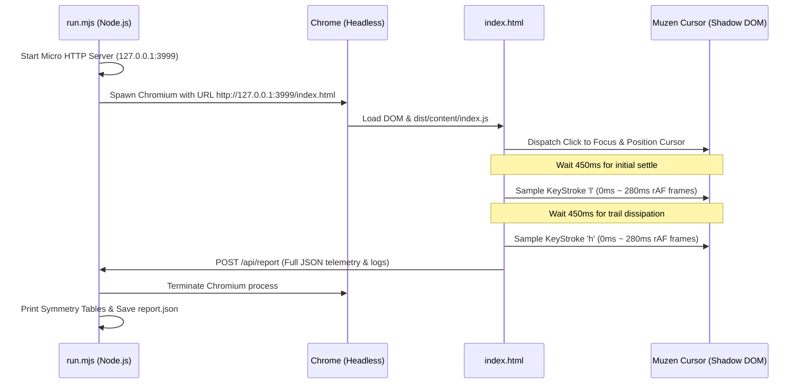

# Muzen Cursor Motion Symmetry & Trail Physics Automated Test Suite

> **Target Audience: AI Coding Assistants / Autonomous Development Agents**  
> This specification documents the automated headless test suite designed to verify Vim cursor trajectory symmetry and ghost trail physics in `muzen-cursor`.

---

## 1. Overview & Purpose

Human visual perception is prone to optical illusions when evaluating micro-animations (0ms–150ms). This test suite eliminates manual inspection ambiguity by programmatically:
1. Spawning a headless instance of Chromium.
2. Emulating Vim keystrokes:
   - **`l` (Single-character rightward step)**
   - **`h` (Single-character leftward step)**
3. Sampling the cursor DOM bounding box (`getBoundingClientRect()`), computed transforms, and active ghost trail elements at sub-frame resolution (~16ms intervals via `requestAnimationFrame`).
4. Calculating mathematical symmetry, vertical drift ($\Delta Y$), and trail relative position vectors.

---

## 2. Directory Structure

```
tests/motion/
├── README.md      # AI Agent guidance & architectural specification (this file)
├── run.mjs        # Node.js supervisor: starts micro HTTP server & launches Headless Chrome
├── index.html     # Browser fixture harness hosting Muzen Cursor Shadow DOM & sampling engine
└── report.json    # JSON report generated after test execution containing raw frame logs
```

---

## 3. Execution Commands

Before running the test suite, ensure production bundles are built:

```bash
# 1. Build TypeScript and Vite distribution bundles
npm run build

# 2. Execute headless motion test
node tests/motion/run.mjs
```

---

## 4. Test Architecture & Workflow



---

## 5. Acceptance Criteria & Evaluation Metrics

Any AI agent modifying motion trail logic or cursor transformations **MUST** ensure all 4 metrics pass:

| Metric | Target / Formula | Acceptance Threshold | Physical Meaning |
| :--- | :--- | :--- | :--- |
| **1. Horizontal Symmetry** | $\|\|\Delta X_{right}\| - \|\Delta X_{left}\|\| < 1.0\text{px}$ | **PASS** | Distance traversed rightward (`l`) equals distance traversed leftward (`h`). |
| **2. Vertical Baseline Flatness** | $|\Delta Y| \le 0.5\text{px}$ | **PASS** | No upward or downward drift during single-line horizontal navigation. |
| **3. Rightward Trail Heading** | $X_{ghost} < X_{cursor}$ | **PASS** | Trail ghost remains strictly at the origin to the **LEFT** of the cursor. |
| **4. Leftward Trail Heading** | $X_{ghost} > X_{cursor}$ | **PASS** | Trail ghost remains strictly at the origin to the **RIGHT** of the cursor. |

---

## 6. Critical Technical Notes for AI Maintenance

### A. The CSS `scale` Matrix Pitfall (DO NOT REINTRODUCE)
* **Root Cause of Historical Bug**:  
  When using independent CSS property `scale: 0.88` inside `@keyframes` on elements positioned with `position: fixed; left: 0; top: 0; transform: translate3d(X, Y, 0)`:  
  Browsers evaluate the independent `scale` property against the global coordinate system, multiplying `(X, Y)` coordinates by `0.88`.  
  This caused ghosts to drift **11px towards the top-left corner `(0, 0)`** during fadeout, creating an optical illusion that rightward trails appeared in the "top-left" and leftward trails were pulled backward.
* **Rule**:  
  Ghost fadeout animations (`@keyframes muzen-ghost-fade`, `@keyframes muzen-stream-fade`) must strictly use `opacity` and optional `filter: blur(...)`. **Never introduce independent `scale` on fixed-positioned ghost elements.**

### B. Landing Bounce vs. In-Flight Stretch
* **Landing Bounce (Arrival)**: Exclusively handled by the main cursor element using CSS cubic-bezier overshoot (`cubic-bezier(0.34, overshoot, 0.64, 1)`) and `settleDeform`.
* **Trail Elements (Departure Origin)**: Trail ghosts represent residual photons at the departure point. They must stay pinned to the launch coordinates and fade out smoothly without local jitter.

---

## 7. Troubleshooting

* **Browser Not Found**: Ensure Google Chrome or Microsoft Edge exists in standard Windows paths (`C:\Program Files\Google\Chrome\Application\chrome.exe` or `msedge.exe`).
* **Bundle Missing**: Run `npm run build` to generate `dist/content/index.js`.
* **Timeout (>12s)**: Verify port `3999` is not blocked by local firewall or another running process.
